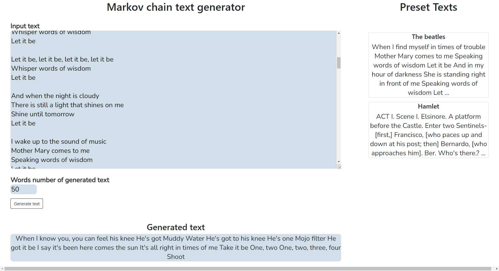

# Markov chain text generator
Website for generating text made with Django REST Framework and React.



# How to install 
### Using docker
```
docker-compose up
```
### Using Python and Node.js
Install all dependencies
```
pip install -r requirements.txt
```
Set setings for the postgresql database
```
DATABASES = {
    'default': {
        'ENGINE': 'django.db.backends.postgresql_psycopg2',
        'NAME': "DATABASE_NAME",
        'USER': "DATABASE_USER",
        'PASSWORD': "DATABASE_USER_PASSWORD",
        'HOST': 'localhost',
        'PORT': ''
    }
}
```
Install node.js and npm/yarn

Run commands
```
cd markov_chain_frontend
yarn install
yarn build
```
# Technologies used
- Python 3.10
- Django 4.0
- Django REST Framework 3.13.1
- PostgreSQL
- React
- Docker
